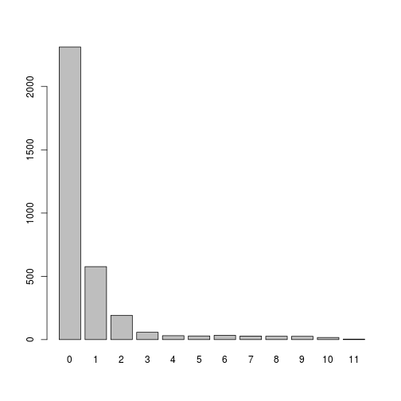

# Quick summary of final dataset obtained


## Number of sequences


```
## [1] 3336
```

## Number of ambiguity characters

 

```
## non_acgt
##    0    1    2    3    4    5    6    7    8    9   10   11 
## 2313  577  192   58   31   29   34   28   27   26   17    4
```

## Outlying sequences

 

### PCA of dist matrix

 

### Top most outlying sequences


```r
normal_ranks <- rank(tot_dist)
normal_ranks <- normal_ranks[order(normal_ranks)]

rank_comp <- data.frame(seq_name = names(normal_ranks),
           normal_rank = normal_ranks,
           normal_dist = tot_dist[match(names(normal_ranks),
                                        names(tot_dist))])
row.names(rank_comp) <- 1:nrow(rank_comp)
kable(head(rank_comp, 25))
```


|seq_name     | normal_rank| normal_dist|
|:------------|-----------:|-----------:|
|CCTACCGCT_37 |          25|    87682.33|
|TCCCGCTTG_18 |          25|    87682.33|
|CTCCCCAAA_28 |          25|    87682.33|
|CACACCGAT_13 |          25|    87682.33|
|CATCTTGTC_21 |          25|    87682.33|
|ACTGAATGT_50 |          25|    87682.33|
|ATTCGTATG_23 |          25|    87682.33|
|ACTTAGCCT_9  |          25|    87682.33|
|TTTAACTTC_27 |          25|    87682.33|
|AAAAAACCA_23 |          25|    87682.33|
|TGTAGCTAC_15 |          25|    87682.33|
|CAAACTATT_20 |          25|    87682.33|
|CCCAAACAA_32 |          25|    87682.33|
|ACTATTTGA_29 |          25|    87682.33|
|CTGGCAGTC_36 |          25|    87682.33|
|GGGTAGCTA_29 |          25|    87682.33|
|GTTTAAAAT_16 |          25|    87682.33|
|GAACAAAAG_6  |          25|    87682.33|
|CGCGGCGGC_7  |          25|    87682.33|
|AACGCCAGA_20 |          25|    87682.33|
|CACCCCCCC_18 |          25|    87682.33|
|TCCTGAGCC_35 |          25|    87682.33|
|TGAGTCAAC_16 |          25|    87682.33|
|GAATGCTCA_40 |          25|    87682.33|
|CCCGTTATA_3  |          25|    87682.33|

```r
kable(tail(rank_comp, 25))
```


|     |seq_name     | normal_rank| normal_dist|
|:----|:------------|-----------:|-----------:|
|3312 |ACCCTGCCA_2  |        3312|    344489.0|
|3313 |CCACATTAA_2  |        3313|    344799.8|
|3314 |TCGCGGCAA_2  |        3314|    345355.6|
|3315 |CTGCGAAAC_25 |        3316|    345378.5|
|3316 |ACTGAATAA_22 |        3316|    345378.5|
|3317 |ACAAATCAC_25 |        3316|    345378.5|
|3318 |GCGGCTGGA_2  |        3318|    345534.2|
|3319 |GTTGGCTCG_5  |        3320|    345551.9|
|3320 |GAAAATAAA_12 |        3320|    345551.9|
|3321 |CAGATGTAC_23 |        3320|    345551.9|
|3322 |AACATGGCA_3  |        3322|    347061.9|
|3323 |GGTAGCCGG_18 |        3323|    348911.8|
|3324 |CATAAATCC_4  |        3324|    349450.2|
|3325 |GGAACTAAA_19 |        3325|    352077.0|
|3326 |CACTCACAT_10 |        3326|    352385.6|
|3327 |AACCCTAAA_5  |        3327|    356009.8|
|3328 |TATAACTTA_20 |        3328|    356285.1|
|3329 |TAGAAGTTG_20 |        3329|    360528.9|
|3330 |AGCCAGGAA_22 |        3330|    360749.3|
|3331 |GCCGAATTT_23 |        3331|    363638.1|
|3332 |TAGCACTGC_2  |        3332|    395148.7|
|3333 |CCGTTCCCA_19 |        3333|    600638.0|
|3334 |AGATCATAC_28 |        3334|    805027.7|
|3335 |CTGACGCCC_2  |        3335|    887888.7|
|3336 |TGATGCTTC_16 |        3336|   2061046.6|
