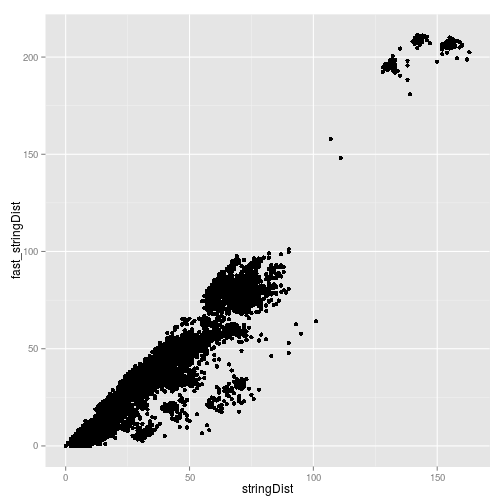

# Report of the performance and accuracy of an alternative distance measure

Use the data from CAP 256 3100 V1V2 to the distances.


```r
library(MotifBinner)
```

```
## Loading required package: ShortRead
## Loading required package: BiocGenerics
## Loading required package: parallel
## 
## Attaching package: 'BiocGenerics'
## 
## The following objects are masked from 'package:parallel':
## 
##     clusterApply, clusterApplyLB, clusterCall, clusterEvalQ,
##     clusterExport, clusterMap, parApply, parCapply, parLapply,
##     parLapplyLB, parRapply, parSapply, parSapplyLB
## 
## The following object is masked from 'package:stats':
## 
##     xtabs
## 
## The following objects are masked from 'package:base':
## 
##     anyDuplicated, append, as.data.frame, as.vector, cbind,
##     colnames, do.call, duplicated, eval, evalq, Filter, Find, get,
##     intersect, is.unsorted, lapply, Map, mapply, match, mget,
##     order, paste, pmax, pmax.int, pmin, pmin.int, Position, rank,
##     rbind, Reduce, rep.int, rownames, sapply, setdiff, sort,
##     table, tapply, union, unique, unlist
## 
## Loading required package: BiocParallel
## Loading required package: Biostrings
## Loading required package: IRanges
## Loading required package: XVector
## Loading required package: Rsamtools
## Loading required package: GenomicRanges
## Loading required package: GenomeInfoDb
## Loading required package: GenomicAlignments
## Loading required package: BSgenome
## Loading required package: ape
## 
## Attaching package: 'ape'
## 
## The following object is masked from 'package:ShortRead':
## 
##     zoom
## 
## Loading required package: doMC
## Loading required package: foreach
## Loading required package: iterators
## Loading required package: shiny
## Loading required package: snowfall
## Loading required package: snow
## 
## Attaching package: 'snow'
## 
## The following objects are masked from 'package:BiocGenerics':
## 
##     clusterApply, clusterApplyLB, clusterCall, clusterEvalQ,
##     clusterExport, clusterMap, clusterSplit, parApply, parCapply,
##     parLapply, parRapply, parSapply
## 
## The following objects are masked from 'package:parallel':
## 
##     clusterApply, clusterApplyLB, clusterCall, clusterEvalQ,
##     clusterExport, clusterMap, clusterSplit, makeCluster,
##     parApply, parCapply, parLapply, parRapply, parSapply,
##     splitIndices, stopCluster
## 
## Loading required package: testthat
```

```r
library(ggplot2)
load('~/projects/ship/data/colin_20150326/CAP256_v1v2/binned/CAP256_3100_030_V1V2/report_dat.rda')
```

The 15 largest bins in this dataset:

```r
n_seq_large <- sort(sapply(report_dat$bbn_dat$bin_seqs, length), TRUE)[1:15]

large_bins <- list()
i <- 0
for (large_bin in unique(n_seq_large)){
  bin_indx <- which(sapply(report_dat$bbn_dat$bin_seqs, length) == large_bin)
  for (indx in bin_indx){
    i <- i + 1
    large_bins[[as.character(i)]] <- report_dat$bbn_dat$bin_seqs[[indx]]
  }
}
```

For each bin, compute the normal stringDist and the optimized distances with up
to 8 anchors


```r
registerDoMC(cores=4)

results <- foreach(i = names(large_bins), .combine=rbind) %dopar% {
  results_tmp <- data.frame(normal_time = numeric(0),
                        fast_time = numeric(0),
                        bin_size = numeric(0),
                        anchors = numeric(0),
                        r_squared = numeric(0))
  normal_time <- system.time(normal_dist <- stringDist(large_bins[[i]]))
  for (j in 2:7){
    print(c(i, j))
    fast_time <- system.time(fast_dist <- fast_stringDist(large_bins[[i]], anchors = j))
    h2h_dmat <- compare_dists(normal_dist, fast_dist)
    mod <- lm(d1 ~ d2, h2h_dmat)
    r_squared <- summary(mod)$r.squared
    results_tmp <- rbind(results_tmp, data.frame(normal_time = as.numeric(normal_time)[1],
                                         fast_time = as.numeric(fast_time)[1],
                                         bin_size = length(large_bins[[i]]),
                                         anchors = j,
                                         r_squared = r_squared))
  }
  results_tmp
}
```
### R-squared value showing agreement between different distance measures

```r
ggplot(aes(x = anchors, y = r_squared, col = as.factor(bin_size)), data = results) + geom_point()
```

 

Note that at least 5 anchors are needed to get an r squared value > 80%. Also,
the r squared value does not show much improvement for more than 5 anchors.

### Relative computation times

```r
ggplot(aes(x = as.factor(anchors), y = fast_time/normal_time, col = as.factor(bin_size)), data = results) + geom_point()
```

 

Note that only for the large bins is the speed up at 5 anchors significant. For
a bin of size 385, computation time is about 18% of the time with stringDist,
while for a bin of size 195, it is about 37%. (numbers subject to change due to
cpu contention from parallelized code)

### Detection of central most sequences and most outlying sequences

### smallest of the large bins selected for previous analysis


```r
curr_bin <- large_bins[[length(large_bins)]]
print('bin size:')
```

```
## [1] "bin size:"
```

```r
print(length(curr_bin))
```

```
## [1] 195
```

```r
normal_dist <- stringDist(curr_bin)
fast_dist <- fast_stringDist(curr_bin)
dist_comp <- compare_dists(normal_dist, fast_dist)
ggplot(aes(x=d1, y=d2), data=dist_comp)+ 
  geom_point() +
  xlab('stringDist') +
  ylab('fast_stringDist')
```

 

See how well the ranks are preserved. For the 20 most outlying sequences as
computed by stringDist, what are their ranks according to fast_stringDist?


```r
normal_tot_dist <- apply(as.matrix(normal_dist), 1, sum)
fast_tot_dist <- apply(as.matrix(fast_dist), 1, sum)

par(mfrow=c(1,2))
hist(normal_tot_dist)
hist(fast_tot_dist)
```

 

```r
par(mfrow=c(1,1))
```

The basic shape of the graphs of the most outlying sequences is preserved.


```r
normal_ranks <- rank(normal_tot_dist)
normal_ranks <- normal_ranks[order(normal_ranks)]
fast_ranks <- rank(fast_tot_dist)

rank_comp <- data.frame(seq_name = names(normal_ranks),
           normal_rank = normal_ranks,
           fast_rank = fast_ranks[match(names(normal_ranks), names(fast_ranks))],
           normal_dist = normal_tot_dist[match(names(normal_ranks),
                                           names(normal_tot_dist))],
           fast_dist = fast_tot_dist[match(names(normal_ranks),
                                           names(fast_tot_dist))])
rank_comp$mismatch <- rank_comp[,2] - rank_comp[,3]

kable(head(rank_comp, 25))
```


|                  |seq_name          | normal_rank| fast_rank| normal_dist| fast_dist| mismatch|
|:-----------------|:-----------------|-----------:|---------:|-----------:|---------:|--------:|
|AACCGATCA_140_146 |AACCGATCA_140_146 |         1.0|      18.5|        4063|  4278.719|    -17.5|
|AACCGATCA_172_178 |AACCGATCA_172_178 |         2.0|      61.0|        4115|  4437.468|    -59.0|
|AACCGATCA_19_19   |AACCGATCA_19_19   |         3.0|      35.0|        4136|  4314.751|    -32.0|
|AACCGATCA_171_177 |AACCGATCA_171_177 |         4.0|       2.0|        4139|  4211.514|      2.0|
|AACCGATCA_112_116 |AACCGATCA_112_116 |         5.0|      50.0|        4156|  4378.634|    -45.0|
|AACCGATCA_36_36   |AACCGATCA_36_36   |         6.0|      53.0|        4179|  4389.342|    -47.0|
|AACCGATCA_156_162 |AACCGATCA_156_162 |         7.0|       8.5|        4184|  4246.091|     -1.5|
|AACCGATCA_97_99   |AACCGATCA_97_99   |         8.0|      16.0|        4207|  4277.845|     -8.0|
|AACCGATCA_39_39   |AACCGATCA_39_39   |         9.0|      30.0|        4211|  4302.146|    -21.0|
|AACCGATCA_131_136 |AACCGATCA_131_136 |        10.5|     133.0|        4212|  5485.554|   -122.5|
|AACCGATCA_89_91   |AACCGATCA_89_91   |        10.5|      33.5|        4212|  4314.347|    -23.0|
|AACCGATCA_163_169 |AACCGATCA_163_169 |        12.0|      12.0|        4214|  4256.955|      0.0|
|AACCGATCA_153_159 |AACCGATCA_153_159 |        13.0|     124.0|        4219|  5126.933|   -111.0|
|AACCGATCA_59_134  |AACCGATCA_59_134  |        14.5|      18.5|        4220|  4278.719|     -4.0|
|AACCGATCA_59_60   |AACCGATCA_59_60   |        14.5|      18.5|        4220|  4278.719|     -4.0|
|AACCGATCA_74_75   |AACCGATCA_74_75   |        16.0|      23.5|        4229|  4280.223|     -7.5|
|AACCGATCA_118_122 |AACCGATCA_118_122 |        17.0|     105.5|        4231|  5006.396|    -88.5|
|AACCGATCA_40_40   |AACCGATCA_40_40   |        18.0|      18.5|        4253|  4278.719|     -0.5|
|AACCGATCA_87_88   |AACCGATCA_87_88   |        19.5|     112.5|        4261|  5039.261|    -93.0|
|AACCGATCA_87_90   |AACCGATCA_87_90   |        19.5|     112.5|        4261|  5039.261|    -93.0|
|AACCGATCA_158_164 |AACCGATCA_158_164 |        21.0|      64.0|        4265|  4444.454|    -43.0|
|AACCGATCA_128_132 |AACCGATCA_128_132 |        22.0|     121.5|        4269|  5118.689|    -99.5|
|AACCGATCA_32_32   |AACCGATCA_32_32   |        23.0|     115.0|        4272|  5068.185|    -92.0|
|AACCGATCA_75_76   |AACCGATCA_75_76   |        24.0|      45.5|        4274|  4347.223|    -21.5|
|AACCGATCA_25_25   |AACCGATCA_25_25   |        25.0|      41.5|        4277|  4334.626|    -16.5|

```r
kable(tail(rank_comp, 25))
```


|                  |seq_name          | normal_rank| fast_rank| normal_dist| fast_dist| mismatch|
|:-----------------|:-----------------|-----------:|---------:|-----------:|---------:|--------:|
|AACCGATCA_187_193 |AACCGATCA_187_193 |         171|     156.0|        8667|  6672.511|     15.0|
|AACCGATCA_157_163 |AACCGATCA_157_163 |         172|     173.0|        8841|  8195.513|     -1.0|
|AACCGATCA_101_104 |AACCGATCA_101_104 |         173|     166.0|        9020|  6987.065|      7.0|
|AACCGATCA_155_161 |AACCGATCA_155_161 |         174|     175.0|        9471|  9080.152|     -1.0|
|AACCGATCA_48_49   |AACCGATCA_48_49   |         175|     174.0|        9921|  8780.408|      1.0|
|AACCGATCA_81_82   |AACCGATCA_81_82   |         176|     176.0|       10574| 10469.592|      0.0|
|AACCGATCA_107_110 |AACCGATCA_107_110 |         177|     180.0|       10892| 12281.439|     -3.0|
|AACCGATCA_124_128 |AACCGATCA_124_128 |         178|     187.0|       11102| 13680.844|     -9.0|
|AACCGATCA_38_38   |AACCGATCA_38_38   |         179|     182.0|       11110| 13177.034|     -3.0|
|AACCGATCA_45_46   |AACCGATCA_45_46   |         180|     179.0|       11165| 12187.525|      1.0|
|AACCGATCA_82_83   |AACCGATCA_82_83   |         181|     191.0|       11339| 14018.542|    -10.0|
|AACCGATCA_15_15   |AACCGATCA_15_15   |         182|     183.0|       11374| 13305.495|     -1.0|
|AACCGATCA_92_94   |AACCGATCA_92_94   |         183|     178.0|       11383| 11890.450|      5.0|
|AACCGATCA_83_84   |AACCGATCA_83_84   |         184|     189.5|       11453| 13821.512|     -5.5|
|AACCGATCA_105_108 |AACCGATCA_105_108 |         185|     193.0|       11486| 14106.157|     -8.0|
|AACCGATCA_16_16   |AACCGATCA_16_16   |         186|     189.5|       11508| 13821.512|     -3.5|
|AACCGATCA_17_17   |AACCGATCA_17_17   |         187|     192.0|       11537| 14045.991|     -5.0|
|AACCGATCA_151_157 |AACCGATCA_151_157 |         188|     184.0|       11586| 13315.841|      4.0|
|AACCGATCA_150_156 |AACCGATCA_150_156 |         189|     185.0|       11721| 13477.758|      4.0|
|AACCGATCA_152_158 |AACCGATCA_152_158 |         190|     186.0|       11878| 13478.512|      4.0|
|AACCGATCA_30_30   |AACCGATCA_30_30   |         191|     188.0|       12069| 13721.289|      3.0|
|AACCGATCA_154_160 |AACCGATCA_154_160 |         192|     194.0|       12346| 15756.804|     -2.0|
|AACCGATCA_186_192 |AACCGATCA_186_192 |         193|     177.0|       12568| 11833.770|     16.0|
|AACCGATCA_189_195 |AACCGATCA_189_195 |         194|     181.0|       12655| 12798.965|     13.0|
|AACCGATCA_14_14   |AACCGATCA_14_14   |         195|     195.0|       28219| 39473.426|      0.0|

From the first table, we note that the ranks for the central most sequences are
not well preserved - however, this is not a major concern since the central
most sequences are extremely close to each other.

The most important thing is to note that there is one sequence that is very
distant from the other sequences (the last one in the table) and that both
distance measures places this one last. Hence serious outliers can still be
detected.

### 2nd smallest of the large bins selected for previous analysis


```r
curr_bin <- large_bins[[length(large_bins) - 1]]
print('bin size:')
```

```
## [1] "bin size:"
```

```r
print(length(curr_bin))
```

```
## [1] 207
```

```r
normal_dist <- stringDist(curr_bin)
fast_dist <- fast_stringDist(curr_bin)
dist_comp <- compare_dists(normal_dist, fast_dist)
ggplot(aes(x=d1, y=d2), data=dist_comp)+ 
  geom_point() +
  xlab('stringDist') +
  ylab('fast_stringDist')
```

 

See how well the ranks are preserved. For the 20 most outlying sequences as
computed by stringDist, what are their ranks according to fast_stringDist?


```r
normal_tot_dist <- apply(as.matrix(normal_dist), 1, sum)
fast_tot_dist <- apply(as.matrix(fast_dist), 1, sum)

par(mfrow=c(1,2))
hist(normal_tot_dist)
hist(fast_tot_dist)
```

 

```r
par(mfrow=c(1,1))
```

The basic shape of the graphs of the most outlying sequences is preserved.


```r
normal_ranks <- rank(normal_tot_dist)
normal_ranks <- normal_ranks[order(normal_ranks)]
fast_ranks <- rank(fast_tot_dist)

rank_comp <- data.frame(seq_name = names(normal_ranks),
           normal_rank = normal_ranks,
           fast_rank = fast_ranks[match(names(normal_ranks), names(fast_ranks))],
           normal_dist = normal_tot_dist[match(names(normal_ranks),
                                           names(normal_tot_dist))],
           fast_dist = fast_tot_dist[match(names(normal_ranks),
                                           names(fast_tot_dist))])
rank_comp$mismatch <- rank_comp[,2] - rank_comp[,3]

kable(head(rank_comp, 25))
```


|                  |seq_name          | normal_rank| fast_rank| normal_dist| fast_dist| mismatch|
|:-----------------|:-----------------|-----------:|---------:|-----------:|---------:|--------:|
|TAAACTCTT_70_72   |TAAACTCTT_70_72   |         1.0|      56.5|        5464|  6371.891|    -55.5|
|TAAACTCTT_98_102  |TAAACTCTT_98_102  |         2.0|      34.5|        5479|  6260.480|    -32.5|
|TAAACTCTT_9_9     |TAAACTCTT_9_9     |         3.0|      11.0|        5498|  6190.991|     -8.0|
|TAAACTCTT_114_119 |TAAACTCTT_114_119 |         4.0|      66.0|        5505|  6398.516|    -62.0|
|TAAACTCTT_99_103  |TAAACTCTT_99_103  |         5.0|      60.0|        5539|  6384.504|    -55.0|
|TAAACTCTT_157_162 |TAAACTCTT_157_162 |         6.0|      39.0|        5551|  6269.281|    -33.0|
|TAAACTCTT_183_191 |TAAACTCTT_183_191 |         7.0|      29.0|        5560|  6252.631|    -22.0|
|TAAACTCTT_89_93   |TAAACTCTT_89_93   |         8.0|      77.0|        5564|  6518.716|    -69.0|
|TAAACTCTT_145_150 |TAAACTCTT_145_150 |         9.0|      51.0|        5576|  6353.774|    -42.0|
|TAAACTCTT_152_157 |TAAACTCTT_152_157 |        10.5|      39.0|        5585|  6269.281|    -28.5|
|TAAACTCTT_186_194 |TAAACTCTT_186_194 |        10.5|      34.5|        5585|  6260.480|    -24.0|
|TAAACTCTT_43_44   |TAAACTCTT_43_44   |        12.0|      37.0|        5593|  6268.825|    -25.0|
|TAAACTCTT_94_98   |TAAACTCTT_94_98   |        13.0|      58.0|        5596|  6382.323|    -45.0|
|TAAACTCTT_77_81   |TAAACTCTT_77_81   |        14.0|      71.0|        5606|  6424.913|    -57.0|
|TAAACTCTT_38_113  |TAAACTCTT_38_113  |        15.5|       2.5|        5610|  6166.167|     13.0|
|TAAACTCTT_38_39   |TAAACTCTT_38_39   |        15.5|       2.5|        5610|  6166.167|     13.0|
|TAAACTCTT_68_70   |TAAACTCTT_68_70   |        17.0|      56.5|        5618|  6371.891|    -39.5|
|TAAACTCTT_52_170  |TAAACTCTT_52_170  |        18.5|      54.5|        5626|  6365.733|    -36.0|
|TAAACTCTT_52_54   |TAAACTCTT_52_54   |        18.5|      54.5|        5626|  6365.733|    -36.0|
|TAAACTCTT_84_88   |TAAACTCTT_84_88   |        20.0|      49.0|        5637|  6334.546|    -29.0|
|TAAACTCTT_110_115 |TAAACTCTT_110_115 |        21.0|      65.0|        5646|  6396.243|    -44.0|
|TAAACTCTT_75_79   |TAAACTCTT_75_79   |        22.0|      23.0|        5653|  6232.963|     -1.0|
|TAAACTCTT_168_174 |TAAACTCTT_168_174 |        23.0|      69.0|        5654|  6417.374|    -46.0|
|TAAACTCTT_30_31   |TAAACTCTT_30_31   |        24.0|      32.5|        5658|  6260.068|     -8.5|
|TAAACTCTT_48_50   |TAAACTCTT_48_50   |        25.0|      75.0|        5666|  6474.346|    -50.0|

```r
kable(tail(rank_comp, 25))
```


|                  |seq_name          | normal_rank| fast_rank| normal_dist| fast_dist| mismatch|
|:-----------------|:-----------------|-----------:|---------:|-----------:|---------:|--------:|
|TAAACTCTT_53_55   |TAAACTCTT_53_55   |         183|       144|        8950|  9778.002|       39|
|TAAACTCTT_76_80   |TAAACTCTT_76_80   |         184|       123|        8988|  9486.799|       61|
|TAAACTCTT_103_107 |TAAACTCTT_103_107 |         185|       192|        9125| 10893.938|       -7|
|TAAACTCTT_189_197 |TAAACTCTT_189_197 |         186|       115|        9128|  9316.359|       71|
|TAAACTCTT_74_78   |TAAACTCTT_74_78   |         187|       187|        9185| 10730.573|        0|
|TAAACTCTT_199_207 |TAAACTCTT_199_207 |         188|       164|        9264| 10283.740|       24|
|TAAACTCTT_109_114 |TAAACTCTT_109_114 |         189|       179|        9282| 10559.702|       10|
|TAAACTCTT_95_99   |TAAACTCTT_95_99   |         190|       147|        9321|  9800.171|       43|
|TAAACTCTT_92_96   |TAAACTCTT_92_96   |         191|       163|        9355| 10277.559|       28|
|TAAACTCTT_72_75   |TAAACTCTT_72_75   |         192|       158|        9378| 10165.293|       34|
|TAAACTCTT_136_141 |TAAACTCTT_136_141 |         193|       124|        9411|  9499.472|       69|
|TAAACTCTT_123_128 |TAAACTCTT_123_128 |         194|        92|        9530|  8732.286|      102|
|TAAACTCTT_22_23   |TAAACTCTT_22_23   |         195|       173|        9567| 10430.752|       22|
|TAAACTCTT_197_205 |TAAACTCTT_197_205 |         196|       186|        9829| 10696.645|       10|
|TAAACTCTT_167_173 |TAAACTCTT_167_173 |         197|       184|       10029| 10656.537|       13|
|TAAACTCTT_67_69   |TAAACTCTT_67_69   |         198|        91|       10190|  8436.673|      107|
|TAAACTCTT_131_136 |TAAACTCTT_131_136 |         199|        89|       10212|  8190.045|      110|
|TAAACTCTT_192_200 |TAAACTCTT_192_200 |         200|        84|       10274|  7923.687|      116|
|TAAACTCTT_18_19   |TAAACTCTT_18_19   |         201|       206|       10384| 14156.385|       -5|
|TAAACTCTT_130_135 |TAAACTCTT_130_135 |         202|       200|       10385| 11158.307|        2|
|TAAACTCTT_91_95   |TAAACTCTT_91_95   |         203|        88|       10540|  8182.847|      115|
|TAAACTCTT_195_203 |TAAACTCTT_195_203 |         204|       198|       10788| 11093.402|        6|
|TAAACTCTT_2_2     |TAAACTCTT_2_2     |         205|        86|       11540|  8067.993|      119|
|TAAACTCTT_166_172 |TAAACTCTT_166_172 |         206|       202|       11947| 11238.898|        4|
|TAAACTCTT_191_199 |TAAACTCTT_191_199 |         207|       207|       22842| 32421.795|        0|

From the first table, we note that the ranks for the central most sequences are
not well preserved - however, this is not a major concern since the central
most sequences are extremely close to each other.

The most important thing is to note that there is one sequence that is very
distant from the other sequences (the last one in the table) and that both
distance measures places this one last. Hence serious outliers can still be
detected.

### 3rd smallest of the large bins selected for previous analysis


```r
curr_bin <- large_bins[[length(large_bins) - 2]]
print('bin size:')
```

```
## [1] "bin size:"
```

```r
print(length(curr_bin))
```

```
## [1] 213
```

```r
normal_dist <- stringDist(curr_bin)
fast_dist <- fast_stringDist(curr_bin)
dist_comp <- compare_dists(normal_dist, fast_dist)
ggplot(aes(x=d1, y=d2), data=dist_comp)+ 
  geom_point() +
  xlab('stringDist') +
  ylab('fast_stringDist')
```

 

See how well the ranks are preserved. For the 20 most outlying sequences as
computed by stringDist, what are their ranks according to fast_stringDist?


```r
normal_tot_dist <- apply(as.matrix(normal_dist), 1, sum)
fast_tot_dist <- apply(as.matrix(fast_dist), 1, sum)

par(mfrow=c(1,2))
hist(normal_tot_dist)
hist(fast_tot_dist)
```

 

```r
par(mfrow=c(1,1))
```

The basic shape of the graphs of the most outlying sequences is preserved.


```r
normal_ranks <- rank(normal_tot_dist)
normal_ranks <- normal_ranks[order(normal_ranks)]
fast_ranks <- rank(fast_tot_dist)

rank_comp <- data.frame(seq_name = names(normal_ranks),
           normal_rank = normal_ranks,
           fast_rank = fast_ranks[match(names(normal_ranks), names(fast_ranks))],
           normal_dist = normal_tot_dist[match(names(normal_ranks),
                                           names(normal_tot_dist))],
           fast_dist = fast_tot_dist[match(names(normal_ranks),
                                           names(fast_tot_dist))])
rank_comp$mismatch <- rank_comp[,2] - rank_comp[,3]

kable(head(rank_comp, 25))
```


|                  |seq_name          | normal_rank| fast_rank| normal_dist| fast_dist| mismatch|
|:-----------------|:-----------------|-----------:|---------:|-----------:|---------:|--------:|
|ACGCCTCCT_94_94   |ACGCCTCCT_94_94   |         1.5|     105.5|        3994|  4060.720|   -104.0|
|ACGCCTCCT_94_96   |ACGCCTCCT_94_96   |         1.5|     105.5|        3994|  4060.720|   -104.0|
|ACGCCTCCT_170_174 |ACGCCTCCT_170_174 |         3.0|     107.0|        4048|  4065.423|   -104.0|
|ACGCCTCCT_145_148 |ACGCCTCCT_145_148 |         4.0|      84.0|        4055|  3987.116|    -80.0|
|ACGCCTCCT_125_128 |ACGCCTCCT_125_128 |         5.0|     122.5|        4070|  4183.577|   -117.5|
|ACGCCTCCT_96_97   |ACGCCTCCT_96_97   |         6.0|     122.5|        4084|  4183.577|   -116.5|
|ACGCCTCCT_155_158 |ACGCCTCCT_155_158 |         7.0|     119.0|        4089|  4159.527|   -112.0|
|ACGCCTCCT_31_31   |ACGCCTCCT_31_31   |         8.0|     133.0|        4091|  4359.767|   -125.0|
|ACGCCTCCT_93_93   |ACGCCTCCT_93_93   |         9.0|      43.5|        4105|  3876.684|    -34.5|
|ACGCCTCCT_158_161 |ACGCCTCCT_158_161 |        10.0|     108.0|        4141|  4072.432|    -98.0|
|ACGCCTCCT_127_130 |ACGCCTCCT_127_130 |        11.0|      41.0|        4155|  3874.846|    -30.0|
|ACGCCTCCT_188_192 |ACGCCTCCT_188_192 |        12.0|      83.0|        4159|  3981.127|    -71.0|
|ACGCCTCCT_75_75   |ACGCCTCCT_75_75   |        13.0|      16.0|        4160|  3788.623|     -3.0|
|ACGCCTCCT_97_113  |ACGCCTCCT_97_113  |        14.5|     133.0|        4176|  4359.767|   -118.5|
|ACGCCTCCT_97_98   |ACGCCTCCT_97_98   |        14.5|     133.0|        4176|  4359.767|   -118.5|
|ACGCCTCCT_83_83   |ACGCCTCCT_83_83   |        16.0|      65.0|        4181|  3925.079|    -49.0|
|ACGCCTCCT_54_54   |ACGCCTCCT_54_54   |        17.0|      17.5|        4182|  3789.160|     -0.5|
|ACGCCTCCT_63_63   |ACGCCTCCT_63_63   |        18.0|      97.0|        4194|  4032.993|    -79.0|
|ACGCCTCCT_73_73   |ACGCCTCCT_73_73   |        19.0|     111.0|        4203|  4102.906|    -92.0|
|ACGCCTCCT_184_188 |ACGCCTCCT_184_188 |        20.0|     114.0|        4204|  4122.323|    -94.0|
|ACGCCTCCT_164_168 |ACGCCTCCT_164_168 |        21.0|      91.0|        4208|  4011.059|    -70.0|
|ACGCCTCCT_78_78   |ACGCCTCCT_78_78   |        22.0|     135.0|        4209|  4392.624|   -113.0|
|ACGCCTCCT_80_80   |ACGCCTCCT_80_80   |        23.0|      85.0|        4217|  3992.392|    -62.0|
|ACGCCTCCT_99_100  |ACGCCTCCT_99_100  |        24.0|     112.0|        4231|  4108.065|    -88.0|
|ACGCCTCCT_115_118 |ACGCCTCCT_115_118 |        25.0|      30.0|        4237|  3824.899|     -5.0|

```r
kable(tail(rank_comp, 25))
```


|                  |seq_name          | normal_rank| fast_rank| normal_dist| fast_dist| mismatch|
|:-----------------|:-----------------|-----------:|---------:|-----------:|---------:|--------:|
|ACGCCTCCT_29_29   |ACGCCTCCT_29_29   |       189.0|     154.0|        9307|  6422.070|       35|
|ACGCCTCCT_202_206 |ACGCCTCCT_202_206 |       190.0|     167.0|        9399|  6718.397|       23|
|ACGCCTCCT_86_86   |ACGCCTCCT_86_86   |       191.0|     156.0|        9693|  6428.529|       35|
|ACGCCTCCT_208_212 |ACGCCTCCT_208_212 |       192.0|     191.0|       11170|  7898.733|        1|
|ACGCCTCCT_154_157 |ACGCCTCCT_154_157 |       193.0|     193.0|       11298|  9880.122|        0|
|ACGCCTCCT_18_18   |ACGCCTCCT_18_18   |       194.0|     194.0|       12469| 10558.178|        0|
|ACGCCTCCT_22_22   |ACGCCTCCT_22_22   |       195.0|     199.0|       12726| 11337.575|       -4|
|ACGCCTCCT_76_76   |ACGCCTCCT_76_76   |       196.0|     200.0|       12768| 11447.009|       -4|
|ACGCCTCCT_151_154 |ACGCCTCCT_151_154 |       197.5|     203.5|       12815| 11519.355|       -6|
|ACGCCTCCT_151_164 |ACGCCTCCT_151_164 |       197.5|     203.5|       12815| 11519.355|       -6|
|ACGCCTCCT_49_49   |ACGCCTCCT_49_49   |       199.0|     207.0|       12852| 11912.298|       -8|
|ACGCCTCCT_17_17   |ACGCCTCCT_17_17   |       200.0|     196.0|       12858| 11128.824|        4|
|ACGCCTCCT_43_43   |ACGCCTCCT_43_43   |       201.0|     197.0|       12896| 11157.493|        4|
|ACGCCTCCT_165_169 |ACGCCTCCT_165_169 |       202.0|     198.0|       12901| 11335.549|        4|
|ACGCCTCCT_139_142 |ACGCCTCCT_139_142 |       203.0|     195.0|       12996| 10984.152|        8|
|ACGCCTCCT_124_127 |ACGCCTCCT_124_127 |       204.0|     201.0|       13019| 11474.627|        3|
|ACGCCTCCT_132_135 |ACGCCTCCT_132_135 |       205.0|     206.0|       13039| 11803.599|       -1|
|ACGCCTCCT_48_48   |ACGCCTCCT_48_48   |       206.0|     202.0|       13051| 11518.876|        4|
|ACGCCTCCT_2_2     |ACGCCTCCT_2_2     |       207.0|     208.0|       13083| 11941.246|       -1|
|ACGCCTCCT_57_57   |ACGCCTCCT_57_57   |       208.0|     205.0|       13195| 11696.149|        3|
|ACGCCTCCT_81_81   |ACGCCTCCT_81_81   |       209.0|     209.0|       13286| 11953.669|        0|
|ACGCCTCCT_19_19   |ACGCCTCCT_19_19   |       210.0|     210.0|       13598| 12001.278|        0|
|ACGCCTCCT_177_181 |ACGCCTCCT_177_181 |       211.0|     211.0|       13721| 12270.187|        0|
|ACGCCTCCT_176_180 |ACGCCTCCT_176_180 |       212.0|     212.0|       18024| 23867.420|        0|
|ACGCCTCCT_12_12   |ACGCCTCCT_12_12   |       213.0|     213.0|       33808| 49675.624|        0|

From the first table, we note that the ranks for the central most sequences are
not well preserved - however, this is not a major concern since the central
most sequences are extremely close to each other.

The most important thing is to note that there are two sequences that are very
distant from the other sequences (the last two in the table) and that both
distance measures places these ones last. Hence serious outliers can still be
detected.

## Conclusions

For very large bins (>500) the speedup is very significant. At a bin size of
3000, the normal stringDist takes more than an hour to run while
fast_stringDist with 5 anchors takes 122 seconds to run.

The loss in accuracy seems to be about 10% when using 5 or more anchors. This
is acceptible for exploratory procedures.

A very preliminary investigation on 3 bins shows that most serious outliers can
still be detected.

Future uses:

1) Will work well for quickly finding outliers in a data set before you perform
multiple alignment

2) Is a potential candidate for use in very large bins during the mislabeling
detection step. However, performance must still be compared vs just down
selecting to 400 sequences for example. Hence just leave the down selection
with a max bin size of 400 for now.
