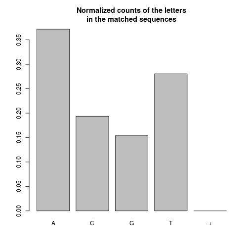
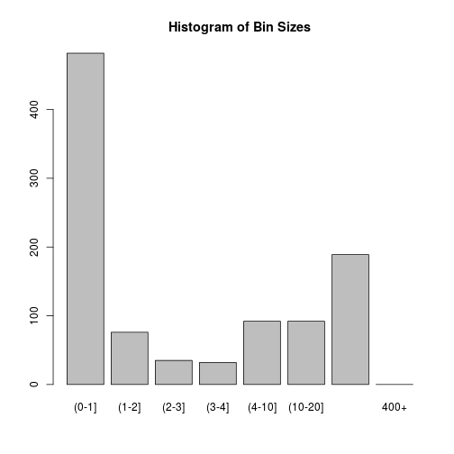

# File bin processing report


## Input File


```r
Sys.time()
```

```
## [1] "2015-03-20 14:36:54 SAST"
```

### A summary of the input sequences


```r
print(seq_dat)
```

```
##   A DNAStringSet instance of length 14575
##         width seq
##     [1]   352 TATGGGATCAAAGTCTAAAACCATGTGTA...TGCTTACCTAACTGAGCGTGTGGCAAGGC
##     [2]   352 TATGGGACGAAAGCCTCAAGCCATGTGTA...TGTTAGATGTTCTGAGCGTGTGGCAAGGC
##     [3]   361 TATGGGACGAAAGTCTAAAGCCATGTGTA...TGTATTGGGGCCTGAGCGTGTGGCAAGGC
##     [4]   419 AATGTCAGCACAGTACAATGTACACATGG...ACTCATGCAACCTGAGCGTGTGGCAAGGC
##     [5]   351 TATGGGACCAAAGTCTAAAGCCATGTGTA...GTGCTATCGAACTGAGCGTGTGGCAAGGC
##     ...   ... ...
## [14571]   352 TATGGGACGAAAGTCTAAAGCCATGTGTA...TGGTACACAAGCTGAGCGTGTGGCAAGGC
## [14572]   352 TATGGGACGAAAGCCTCAAGCTATGTGTA...TGCATTTAAAACTGAGCGTGTGGCAAGGC
## [14573]   352 TATGGGACGAAAGTCTCAAACCATGTGTA...TGGCTCAAGTACTGAGCGTGTGGCAAGGC
## [14574]   361 TATGGGATCAAAGTCTAAAACCATGTGTA...TGAATCCTCTACTGAGCGTGTGGCAAGGC
## [14575]   352 TATGGGACGAAAGTCTAAAGCCATGTGTA...TGTAATTGCGACCGAGCGTGTGGCAAGGC
```

### The letter frequencies

Counts of the letters in the input sequences.

```r
x <- apply(consensusMatrix(seq_dat), 1, sum)
x <- x[x != 0]
kable(data.frame(letter = names(x),
                 count = x,
                 count_per_seq = round(x/length(seq_dat),2),
                 row.names = 1:length(x)))
```


|letter |   count| count_per_seq|
|:------|-------:|-------------:|
|A      | 1889682|        129.65|
|C      | 1028655|         70.58|
|G      |  973999|         66.83|
|T      | 1394116|         95.65|
|N      |      12|          0.00|

Normalized counts of the letters in the input sequences.

```r
x_freq <- round(x/sum(x), 4)
kable(data.frame(letter = names(x_freq),
                 count = x_freq,
                 row.names = 1:length(x_freq)))
```


|letter |  count|
|:------|------:|
|A      | 0.3575|
|C      | 0.1946|
|G      | 0.1842|
|T      | 0.2637|
|N      | 0.0000|


```r
barplot(x/sum(x),
        main = 'Normalized counts of the letters\nin the input sequences')
```

 

### The sequence lengths


```r
hist(width(seq_dat),
     main = "Histogram of the lengths of the input sequences",
     xlab = "Sequence Length",
     ylab = "Number of Sequences")
```

 


## Motif Searches


```r
Sys.time()
```

```
## [1] "2015-03-20 14:36:54 SAST"
```

### Input parameters for the searches

```r
print(prefix)
```

```
## [1] "CCAGCTGGTTATGCGATTCTMARGTG"
```

```r
print(suffix)
```

```
## [1] "CTGAGCGTGTGGCAAGGCCC"
```

```r
print(motif_length)
```

```
## [1] 9
```

### Matched vs Unmatched sequences

```r
n_matched <- length(motif_dat$matched_seq)
n_unmatched <- length(motif_dat$unmatched_seq)
n_total <- n_matched + n_unmatched
kable(data.frame(seq_matched_count = n_matched,
                 seq_matched_perc = 100*round(n_matched / n_total, 4),
                 seq_unmatched_count = n_unmatched,
                 seq_unmatched_perc = 100*round(n_unmatched / n_total, 4)))
```


| seq_matched_count| seq_matched_perc| seq_unmatched_count| seq_unmatched_perc|
|-----------------:|----------------:|-------------------:|------------------:|
|             11561|            79.32|                3014|              20.68|

### Matched Sequences

#### Summary of sequences


```r
print(motif_dat$matched_seq)
```

```
##   A DNAStringSet instance of length 11561
##         width seq                                      names               
##     [1]   299 TATGGGATCAAAGTCTAAA...CCTATACATTATTGTGCT CTTACCTAA
##     [2]   299 TATGGGACGAAAGCCTCAA...CCTATACATTATTGTGCT TTAGATGTT
##     [3]   308 TATGGGACGAAAGTCTAAA...CCTATACATTATTGTGCT TATTGGGGC
##     [4]   299 TATGGGACGAAAGCCTCAA...CCTATACATTATTGTGCT ATTGTGCCA
##     [5]   299 TATGGGATGAAAGCCTCAA...CCTATACATTATTGTGCT GTAGACTGT
##     ...   ... ...
## [11557]   299 TATGGGACGAAAGTCTAAA...CCTATACATTATTGTGCT GTACACAAG
## [11558]   299 TATGGGACGAAAGCCTCAA...CCTATACATTATTGTGCT CATTTAAAA
## [11559]   299 TATGGGACGAAAGTCTCAA...CCTATACATTATTGTGCT GCTCAAGTA
## [11560]   308 TATGGGATCAAAGTCTAAA...CCTATACATTATTGTGCT AATCCTCTA
## [11561]   299 TATGGGACGAAAGTCTAAA...CCTATACATTATGGTGCT TAATTGCGA
```

#### The letter frequencies

Counts of the letters in the matched sequences.

```r
x <- apply(consensusMatrix(motif_dat$matched_seq), 1, sum)
x <- x[x != 0]
kable(data.frame(letter = names(x),
                 count = x,
                 count_per_seq = round(x/length(motif_dat$matched_seq),2),
                 row.names = 1:length(x)))
```


|letter |   count| count_per_seq|
|:------|-------:|-------------:|
|A      | 1296178|        112.12|
|C      |  675110|         58.40|
|G      |  536220|         46.38|
|T      |  978310|         84.62|
|+      |       2|          0.00|

Normalized counts of the letters in the matched sequences.

```r
x_freq <- round(x/sum(x), 4)
kable(data.frame(letter = names(x_freq),
                 count = x_freq,
                 row.names = 1:length(x_freq)))
```


|letter |  count|
|:------|------:|
|A      | 0.3718|
|C      | 0.1937|
|G      | 0.1538|
|T      | 0.2807|
|+      | 0.0000|


```r
barplot(x/sum(x),
        main = 'Normalized counts of the letters\nin the matched sequences')
```

 

#### The sequence lengths


```r
hist(width(motif_dat$matched_seq),
     main = "Histogram of the lengths of the matched sequences",
     xlab = "Sequence Length",
     ylab = "Number of Sequences")
```

 

### Unmatched Sequences
#### Summary of sequences


```r
print(motif_dat$unmatched_seq)
```

```
##   A DNAStringSet instance of length 3014
##        width seq                                       names               
##    [1]   419 AATGTCAGCACAGTACAAT...CCTGAGCGTGTGGCAAGGC seq_4
##    [2]   351 TATGGGACCAAAGTCTAAA...ACTGAGCGTGTGGCAAGGC seq_5
##    [3]   353 TATGGGACGAAAGCCTCAA...CCTGAGCGTGTGGCAAGGC seq_10
##    [4]   351 TATGGGACGAAAGCCTCAA...CCTGAGCGTGTGGCAAGGC seq_15
##    [5]   343 TATGGGATGAAAGCCTAAA...CCTGAGCGTGTGGCAAGGC seq_17
##    ...   ... ...
## [3010]   419 AATGTCAGTACAGTACAAT...ACTGAGCGTGTGGCAAGGC seq_14561
## [3011]   419 AATGTCAGTACAGTACAAT...ACTGAGCGTGTGGCAAGGC seq_14562
## [3012]   418 AATGTCAGTACAGTACAAT...CCTGAGCGTGTGGCAAGGC seq_14563
## [3013]   419 AATGTAAGCACAGTACAAT...CCTGAGCGTGTGGCAAGGC seq_14564
## [3014]   419 AATGTCAGTACAGTACAAT...GCTGAGCTTGTGGCAAGGC seq_14566
```

#### The letter frequencies

Counts of the letters in the unmatched sequences.

```r
x <- apply(consensusMatrix(motif_dat$unmatched_seq), 1, sum)
x <- x[x != 0]
kable(data.frame(letter = names(x),
                 count = x,
                 count_per_seq = round(x/length(motif_dat$unmatched_seq),2),
                 row.names = 1:length(x)))
```


|letter |  count| count_per_seq|
|:------|------:|-------------:|
|A      | 466241|        154.69|
|C      | 213997|         71.00|
|G      | 241376|         80.08|
|T      | 266341|         88.37|
|+      |      8|          0.00|

Normalized counts of the letters in the unmatched sequences.

```r
x_freq <- round(x/sum(x), 4)
kable(data.frame(letter = names(x_freq),
                 count = x_freq,
                 row.names = 1:length(x_freq)))
```


|letter |  count|
|:------|------:|
|A      | 0.3925|
|C      | 0.1801|
|G      | 0.2032|
|T      | 0.2242|
|+      | 0.0000|


```r
barplot(x/sum(x),
        main = 'Normalized counts of the letters\nin the unmatched sequences')
```

 

#### The sequence lengths


```r
hist(width(motif_dat$unmatched_seq),
     main = "Histogram of the lengths of the unmatched sequences",
     xlab = "Sequence Length",
     ylab = "Number of Sequences")
```

 


## The unprocessed bins produced


```r
Sys.time()
```

```
## [1] "2015-03-20 14:36:55 SAST"
```

### The number of bins


```r
print(length(bin_seqs))
```

```
## [1] 998
```

### The sizes of the bins


```r
bin_sizes <- unlist(lapply(bin_seqs, length))
hist(bin_sizes)
```

 

```r
kable(data.frame(bin_size = as.numeric(names(table(bin_sizes))),
                 num_bins = as.numeric(table(bin_sizes))))
```


| bin_size| num_bins|
|--------:|--------:|
|        1|      482|
|        2|       76|
|        3|       35|
|        4|       32|
|        5|       24|
|        6|       20|
|        7|        9|
|        8|       13|
|        9|        9|
|       10|       17|
|       11|       15|
|       12|       10|
|       13|        8|
|       14|        6|
|       15|        6|
|       16|       10|
|       17|        9|
|       18|        8|
|       19|       11|
|       20|        9|
|       21|        5|
|       22|        8|
|       23|        5|
|       24|        5|
|       25|        4|
|       26|        6|
|       27|        6|
|       28|        4|
|       29|        8|
|       30|        8|
|       31|        5|
|       32|        4|
|       33|        4|
|       34|        4|
|       35|        5|
|       36|        3|
|       37|        7|
|       38|        3|
|       39|        5|
|       40|        4|
|       41|        3|
|       43|        3|
|       44|        5|
|       45|        2|
|       46|        5|
|       47|        1|
|       49|        4|
|       51|        1|
|       52|        1|
|       53|        1|
|       54|        1|
|       55|        6|
|       56|        1|
|       57|        3|
|       58|        1|
|       59|        1|
|       60|        3|
|       61|        1|
|       62|        2|
|       63|        1|
|       65|        5|
|       66|        3|
|       67|        3|
|       68|        3|
|       70|        1|
|       73|        4|
|       75|        1|
|       76|        1|
|       77|        1|
|       80|        1|
|       81|        2|
|       82|        1|
|       85|        1|
|       86|        2|
|       87|        1|
|       94|        2|
|       96|        1|
|       97|        2|
|      100|        1|
|      101|        1|
|      103|        1|
|      113|        1|
|      119|        1|

### scatter and log log plot of the bin sizes


```r
loglog <- data.frame(bin_size = as.numeric(names(table(bin_sizes))),
                     num_bins = as.numeric(table(bin_sizes)))
plot(num_bins ~ bin_size, data = loglog)
```

 

```r
plot(log10(num_bins) ~ log10(bin_size), data = loglog)
```

 

### Categories and count frequencies


```r
cats <- hist(bin_sizes, breaks = c(0,1,2,3,4,10,20,400,1000000), plot=FALSE)
counts <- cats$counts
names(counts) <- paste('(', cats$breaks[1:(length(cats$breaks)-1)], 
                  '-', cats$breaks[2:(length(cats$breaks))], ']',
                  sep='')
names(counts)[length(counts)] <- paste(cats$breaks[length(cats$breaks)-1], '+',
                                       sep = '')
barplot(counts, main = 'Histogram of Bin Sizes')
```

 

```r
kable(data.frame(category = names(counts),
                 count = counts,
                 row.names = 1:length(counts)))
```


|category | count|
|:--------|-----:|
|(0-1]    |   482|
|(1-2]    |    76|
|(2-3]    |    35|
|(3-4]    |    32|
|(4-10]   |    92|
|(10-20]  |    92|
|(20-400] |   189|
|400+     |     0|


## Basic report on the processed bins


### Arguments


```r
x <- pb_dat
x$pb_out <- NULL
x$seqs <- NULL
print(x)
```

```
## $classification_technique
## [1] "absolute"
## 
## $classification_params
## $classification_params$threshold
## [1] 0.01333333
## 
## $classification_params$start_threshold
## [1] 0.01333333
## 
## $classification_params$max_sequences
## [1] 100
## 
## 
## $alignment_technique
## [1] "muscle"
## 
## $alignment_params
## list()
## 
## $consensus_technique
## [1] "mostConsensusString"
## 
## $consensus_params
## list()
## 
## $remove_gaps
## [1] TRUE
```

### Compute metrics


### Effects of outlier removal

#### Before and after bin sizes


```r
hist(metrics$input_size)
```

 

```r
hist(metrics$output_size)
```

 

```r
plot(metrics$output_size ~ metrics$input_size)
abline(a=0, b=1)
```

 

##### Where are the small bins coming from?


```r
small_bins <- subset(metrics, output_size < 6)
plot(jitter(small_bins$output_size) ~ jitter(small_bins$input_size))
abline(a=0, b=1)
```

 

#### Before and after bin distances


```r
hist(metrics$in_max_dist)
```

 

```r
hist(metrics$out_max_dist)
```

 

```r
hist(metrics$min_out_dist)
```

 

```r
hist(metrics$in_max_dist - metrics$out_max_dist)
```

 

### Alignment step

#### Number of gaps inserted


```r
hist(metrics$gaps)
```

 

```r
kable(data.frame(num_gaps = as.numeric(names(table(metrics$gaps))),
                 num_alignments = as.numeric(table(metrics$gaps))))
```


| num_gaps| num_alignments|
|--------:|--------------:|
|        0|            356|
|        1|             75|
|        2|             26|
|        3|              7|
|        4|              5|
|        5|              2|
|        6|              3|
|        7|              1|
|        8|              1|
|       14|              1|
|       15|              1|
|       17|              1|
|       18|              1|
|       19|              1|
|       20|              1|
|       21|              1|
|       24|              1|
|       25|              1|
|       26|              1|
|       27|              1|
|       28|              1|
|       32|              1|
|       35|              2|
|       38|              1|
|       42|              1|
|       44|              1|
|       45|              2|
|       47|              1|
|       51|              2|
|       54|              1|
|      118|              1|

#### Number positions with mismatches in the alignment


```r
hist(metrics$pos_no_mismatch)
```

 

```r
hist(metrics$pos_mismatch)
```

 

#### Total number of mismatches


```r
hist(metrics$total_mismatches)
```

 

#### NON-ACGT characters in consensus


```r
hist(metrics$non_acgt)
```

 

```r
kable(data.frame(num_non_acgt = as.numeric(names(table(metrics$non_acgt))),
                 num_con_seq = as.numeric(table(metrics$non_acgt))))
```


| num_non_acgt| num_con_seq|
|------------:|-----------:|
|            0|         324|
|            1|          70|
|            2|          46|
|            3|          18|
|            4|          18|
|            5|          15|
|            6|          10|
