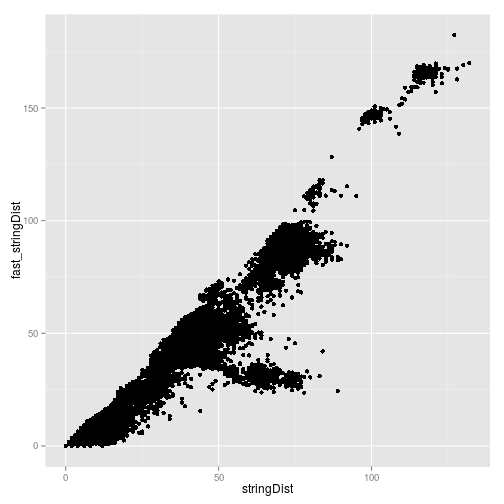
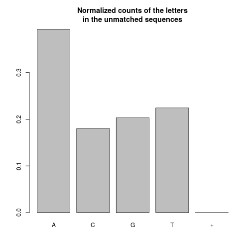

# File bin processing report


## A Basic report on the input file that was provided


```r
Sys.time()
```

```
## [1] "2015-03-19 11:43:31 SAST"
```

### A summary of the input sequences


```r
print(seq_dat)
```

```
##   A DNAStringSet instance of length 14575
##         width seq
##     [1]   352 TATGGGATCAAAGTCTAAAACCATGTGTA...TGCTTACCTAACTGAGCGTGTGGCAAGGC
##     [2]   352 TATGGGACGAAAGCCTCAAGCCATGTGTA...TGTTAGATGTTCTGAGCGTGTGGCAAGGC
##     [3]   361 TATGGGACGAAAGTCTAAAGCCATGTGTA...TGTATTGGGGCCTGAGCGTGTGGCAAGGC
##     [4]   419 AATGTCAGCACAGTACAATGTACACATGG...ACTCATGCAACCTGAGCGTGTGGCAAGGC
##     [5]   351 TATGGGACCAAAGTCTAAAGCCATGTGTA...GTGCTATCGAACTGAGCGTGTGGCAAGGC
##     ...   ... ...
## [14571]   352 TATGGGACGAAAGTCTAAAGCCATGTGTA...TGGTACACAAGCTGAGCGTGTGGCAAGGC
## [14572]   352 TATGGGACGAAAGCCTCAAGCTATGTGTA...TGCATTTAAAACTGAGCGTGTGGCAAGGC
## [14573]   352 TATGGGACGAAAGTCTCAAACCATGTGTA...TGGCTCAAGTACTGAGCGTGTGGCAAGGC
## [14574]   361 TATGGGATCAAAGTCTAAAACCATGTGTA...TGAATCCTCTACTGAGCGTGTGGCAAGGC
## [14575]   352 TATGGGACGAAAGTCTAAAGCCATGTGTA...TGTAATTGCGACCGAGCGTGTGGCAAGGC
```

### The letter frequencies


```r
x <- apply(consensusMatrix(seq_dat), 1, sum)
x <- x[x != 0]
print(x)
```

```
##       A       C       G       T       N 
## 1889682 1028655  973999 1394116      12
```

```r
print(round(x/sum(x), 4))
```

```
##      A      C      G      T      N 
## 0.3575 0.1946 0.1842 0.2637 0.0000
```

```r
barplot(x/sum(x))
```

 

### The sequence lengths


```r
hist(width(seq_dat))
```

 


## A Basic report on search for PIDs in the sequences


```r
Sys.time()
```

```
## [1] "2015-03-19 11:43:31 SAST"
```

### Input parameters

```r
print(prefix)
```

```
## [1] "CCAGCTGGTTATGCGATTCTMARGTG"
```

```r
print(suffix)
```

```
## [1] "CTGAGCGTGTGGCAAGGCCC"
```

```r
print(motif_length)
```

```
## [1] 9
```

### Matched vs Unmatched sequences

```r
n_matched <- length(motif_dat$matched_seq)
n_unmatched <- length(motif_dat$unmatched_seq)
n_total <- n_matched + n_unmatched
print(n_matched)
```

```
## [1] 11561
```

```r
print(round(n_matched / n_total, 4))
```

```
## [1] 0.7932
```

```r
print(n_unmatched)
```

```
## [1] 3014
```

```r
print(round(n_unmatched / n_total, 4))
```

```
## [1] 0.2068
```

### Matched Sequences
#### Summary of sequences


```r
print(motif_dat$matched_seq)
```

```
##   A DNAStringSet instance of length 11561
##         width seq                                      names               
##     [1]   299 TATGGGATCAAAGTCTAAA...CCTATACATTATTGTGCT CTTACCTAA
##     [2]   299 TATGGGACGAAAGCCTCAA...CCTATACATTATTGTGCT TTAGATGTT
##     [3]   308 TATGGGACGAAAGTCTAAA...CCTATACATTATTGTGCT TATTGGGGC
##     [4]   299 TATGGGACGAAAGCCTCAA...CCTATACATTATTGTGCT ATTGTGCCA
##     [5]   299 TATGGGATGAAAGCCTCAA...CCTATACATTATTGTGCT GTAGACTGT
##     ...   ... ...
## [11557]   299 TATGGGACGAAAGTCTAAA...CCTATACATTATTGTGCT GTACACAAG
## [11558]   299 TATGGGACGAAAGCCTCAA...CCTATACATTATTGTGCT CATTTAAAA
## [11559]   299 TATGGGACGAAAGTCTCAA...CCTATACATTATTGTGCT GCTCAAGTA
## [11560]   308 TATGGGATCAAAGTCTAAA...CCTATACATTATTGTGCT AATCCTCTA
## [11561]   299 TATGGGACGAAAGTCTAAA...CCTATACATTATGGTGCT TAATTGCGA
```

#### The letter frequencies


```r
x <- apply(consensusMatrix(motif_dat$matched_seq), 1, sum)
x <- x[x != 0]
print(x)
```

```
##       A       C       G       T       + 
## 1296178  675110  536220  978310       2
```

```r
print(round(x/sum(x), 4))
```

```
##      A      C      G      T      + 
## 0.3718 0.1937 0.1538 0.2807 0.0000
```

```r
barplot(x/sum(x))
```

 

#### The sequence lengths


```r
hist(width(motif_dat$matched_seq))
```

 

### Unmatched Sequences
#### Summary of sequences


```r
print(motif_dat$unmatched_seq)
```

```
##   A DNAStringSet instance of length 3014
##        width seq                                       names               
##    [1]   419 AATGTCAGCACAGTACAAT...CCTGAGCGTGTGGCAAGGC seq_4
##    [2]   351 TATGGGACCAAAGTCTAAA...ACTGAGCGTGTGGCAAGGC seq_5
##    [3]   353 TATGGGACGAAAGCCTCAA...CCTGAGCGTGTGGCAAGGC seq_10
##    [4]   351 TATGGGACGAAAGCCTCAA...CCTGAGCGTGTGGCAAGGC seq_15
##    [5]   343 TATGGGATGAAAGCCTAAA...CCTGAGCGTGTGGCAAGGC seq_17
##    ...   ... ...
## [3010]   419 AATGTCAGTACAGTACAAT...ACTGAGCGTGTGGCAAGGC seq_14561
## [3011]   419 AATGTCAGTACAGTACAAT...ACTGAGCGTGTGGCAAGGC seq_14562
## [3012]   418 AATGTCAGTACAGTACAAT...CCTGAGCGTGTGGCAAGGC seq_14563
## [3013]   419 AATGTAAGCACAGTACAAT...CCTGAGCGTGTGGCAAGGC seq_14564
## [3014]   419 AATGTCAGTACAGTACAAT...GCTGAGCTTGTGGCAAGGC seq_14566
```

#### The letter frequencies


```r
x <- apply(consensusMatrix(motif_dat$unmatched_seq), 1, sum)
x <- x[x != 0]
print(x)
```

```
##      A      C      G      T      + 
## 466241 213997 241376 266341      8
```

```r
print(round(x/sum(x), 4))
```

```
##      A      C      G      T      + 
## 0.3925 0.1801 0.2032 0.2242 0.0000
```

```r
barplot(x/sum(x))
```

 

#### The sequence lengths


```r
hist(width(motif_dat$unmatched_seq))
```

 


## A Basic report on the bins produced


```r
Sys.time()
```

```
## [1] "2015-03-19 11:43:31 SAST"
```

### The number of bins


```r
print(length(bin_seqs))
```

```
## [1] 998
```

### The sizes of the bins


```r
bin_sizes <- unlist(lapply(bin_seqs, length))
hist(bin_sizes)
```

 

```r
kable(data.frame(bin_size = as.numeric(names(table(bin_sizes))),
                 num_bins = as.numeric(table(bin_sizes))))
```


| bin_size| num_bins|
|--------:|--------:|
|        1|      482|
|        2|       76|
|        3|       35|
|        4|       32|
|        5|       24|
|        6|       20|
|        7|        9|
|        8|       13|
|        9|        9|
|       10|       17|
|       11|       15|
|       12|       10|
|       13|        8|
|       14|        6|
|       15|        6|
|       16|       10|
|       17|        9|
|       18|        8|
|       19|       11|
|       20|        9|
|       21|        5|
|       22|        8|
|       23|        5|
|       24|        5|
|       25|        4|
|       26|        6|
|       27|        6|
|       28|        4|
|       29|        8|
|       30|        8|
|       31|        5|
|       32|        4|
|       33|        4|
|       34|        4|
|       35|        5|
|       36|        3|
|       37|        7|
|       38|        3|
|       39|        5|
|       40|        4|
|       41|        3|
|       43|        3|
|       44|        5|
|       45|        2|
|       46|        5|
|       47|        1|
|       49|        4|
|       51|        1|
|       52|        1|
|       53|        1|
|       54|        1|
|       55|        6|
|       56|        1|
|       57|        3|
|       58|        1|
|       59|        1|
|       60|        3|
|       61|        1|
|       62|        2|
|       63|        1|
|       65|        5|
|       66|        3|
|       67|        3|
|       68|        3|
|       70|        1|
|       73|        4|
|       75|        1|
|       76|        1|
|       77|        1|
|       80|        1|
|       81|        2|
|       82|        1|
|       85|        1|
|       86|        2|
|       87|        1|
|       94|        2|
|       96|        1|
|       97|        2|
|      100|        1|
|      101|        1|
|      103|        1|
|      113|        1|
|      119|        1|

### log log plot of the bin sizes


```r
loglog <- data.frame(bin_size = as.numeric(names(table(bin_sizes))),
                     num_bins = as.numeric(table(bin_sizes)))
plot(num_bins ~ bin_size, data = loglog)
```

 

```r
plot(log(num_bins) ~ bin_size, data = loglog)
```

 

```r
plot(log(num_bins) ~ log(bin_size), data = loglog)
```

 

### TODO: Make categories and count frequencies


## Basic report on the processed bins


### Arguments


```r
x <- pb_dat
x$pb_out <- NULL
x$seqs <- NULL
print(x)
```

```
## $classification_technique
## [1] "absolute"
## 
## $classification_params
## $classification_params$threshold
## [1] 0.01333333
## 
## $classification_params$start_threshold
## [1] 0.02333333
## 
## $classification_params$max_sequences
## [1] 100
## 
## 
## $alignment_technique
## [1] "muscle"
## 
## $alignment_params
## list()
## 
## $consensus_technique
## [1] "mostConsensusString"
## 
## $consensus_params
## list()
## 
## $remove_gaps
## [1] TRUE
```

### Compute metrics


### Effects of outlier removal

#### Before and after bin sizes


```r
hist(metrics$input_size)
```

 

```r
hist(metrics$output_size)
```

 

```r
plot(metrics$output_size ~ metrics$input_size)
abline(a=0, b=1)
```

 

##### Where are the small bins coming from?


```r
small_bins <- subset(metrics, output_size < 6)
plot(jitter(small_bins$output_size) ~ jitter(small_bins$input_size))
abline(a=0, b=1)
```

 

#### Before and after bin distances


```r
hist(metrics$in_max_dist)
```

 

```r
hist(metrics$out_max_dist)
```

 

```r
hist(metrics$min_out_dist)
```

 

```r
hist(metrics$in_max_dist - metrics$out_max_dist)
```

 

### Alignment step

#### Number of gaps inserted


```r
hist(metrics$gaps)
```

 

```r
kable(data.frame(num_gaps = as.numeric(names(table(metrics$gaps))),
                 num_alignments = as.numeric(table(metrics$gaps))))
```


| num_gaps| num_alignments|
|--------:|--------------:|
|        0|            359|
|        1|             76|
|        2|             26|
|        3|              8|
|        4|              5|
|        5|              2|
|        6|              2|
|        7|              2|
|        8|              1|
|        9|              2|
|       15|              2|
|       17|              1|
|       18|              1|
|       19|              1|
|       20|              1|
|       21|              1|
|       24|              1|
|       25|              1|
|       26|              1|
|       27|              1|
|       28|              1|
|       32|              1|
|       35|              2|
|       38|              1|
|       42|              1|
|       44|              1|
|       45|              2|
|       47|              1|
|       51|              2|
|       54|              1|
|      118|              1|

#### Number positions with mismatches in the alignment


```r
hist(metrics$pos_no_mismatch)
```

 

```r
hist(metrics$pos_mismatch)
```

 

#### Total number of mismatches


```r
hist(metrics$total_mismatches)
```

 

#### NON-ACGT characters in consensus


```r
hist(metrics$non_acgt)
```

 

```r
kable(data.frame(num_non_acgt = as.numeric(names(table(metrics$non_acgt))),
                 num_con_seq = as.numeric(table(metrics$non_acgt))))
```


| num_non_acgt| num_con_seq|
|------------:|-----------:|
|            0|         326|
|            1|          74|
|            2|          42|
|            3|          19|
|            4|          17|
|            5|          14|
|            6|           9|
|            8|           2|
|            9|           1|
|           10|           1|
|           11|           1|
|           13|           2|
